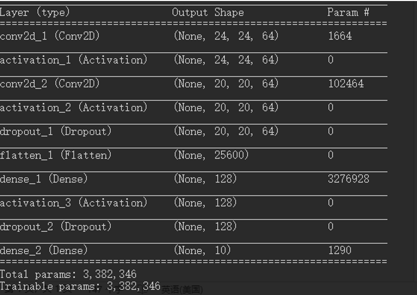
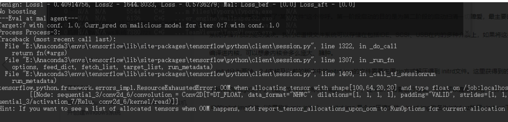
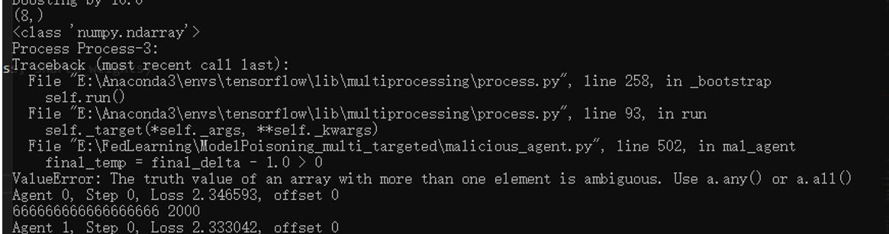

### 实验环境

数据集：Fashion Mnist

神经网络结构: 

优化算法：SGD

聚合算法：FedAvg

客户端数量: 10

恶意客户端数量：1

迭代次数：10次；

### 实验结果分析

（对梯度进行Top-k稀疏化的代码有问题，会出现资源耗尽的错误，我改不了，就只用了阈值过滤）阈值过滤的方法要比直接攻击的效果好很多，且全局模型收敛速度更快，甚至超过了没有攻击者的情况，个人觉得是全局模型恰好选到了效果较好的客户端，需要多做几次实验，以确定效果。那篇论文采用的交替型参数优化算法，也会出现资源耗尽的问题。

由于鲁棒性聚合算法Krum，代码实现上还存在bug，还未对鲁棒性聚合模型进行实验，不过仔细一想，估计效果不会好，因为无论是Top-K还是阈值过滤，都会让模型距离与其余的模型疏远，对于基于距离的鲁棒性算法效果估计没有这篇论文的这么好

### 相关论文阅读

对这篇引用这篇文章的谷歌学术上的文章阅读，论文的创新点是在数据集毒化上的创新，其中一篇是用生成对抗网络做的；还有一篇，是从后门攻击的角度做的，还有个专门做模型攻击的，Model poisoning 那篇文章提出了一种新的优化算法，但没指出这篇文章的不好之处。

### 缺点：

模型距离，因为把模型的更新进行了Top-k的过滤，模型距离发生了变化，基于模型距离相似性聚合的算法，下一步，打算测一下Krum算法的性能。

### 任务

算法定性，改进算法。思路和方向预想的情况。算法模型ok，然后再做实验。

1、根据idea设计算法。（Top-k或者梯度过滤）写出算法流程图。

距离，正常的是一个收敛的过程，