从keras中导入mnist会导致报如下的错：

tensorflow.python.pywrap_tensorflow' has no attribute 'TFE_DEVICE_PLACEMENT_EXPLICIT

解决方法，提前把数据集下好，然后把相关的依赖都删掉。

但是细读代码，发现模型中的卷积层都没有实现。modelA~H，代码离能跑距离有点远。

细读算法：

### 搭建环境遇到的问题

作者写的代码是用的python2写的，从python2转成python3，费了不少时间。主要print加括号，以及包的相对路径需要更改。

开始tensorflow版本太新，有些方法已经淘汰了。

对tensorflow进行版本回退。回退至作者说的版本1.8

回退过后，会遇到如下问题：

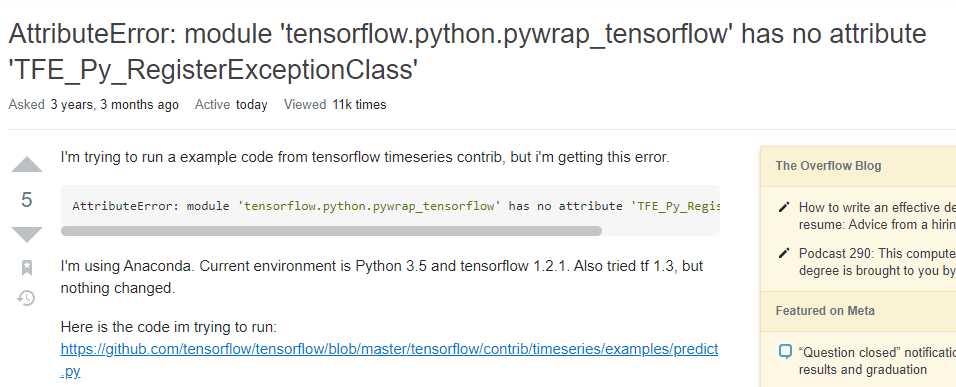

原因是keras与tensorflow版本不兼容导致的，卸载keras，重新下一个低版本的keras解决。别听这个回答下的瞎扯。

windows下python路径“\”转义问题，两个\就可以了。

读完路径正确，能够跑了，但是又有如下问题：

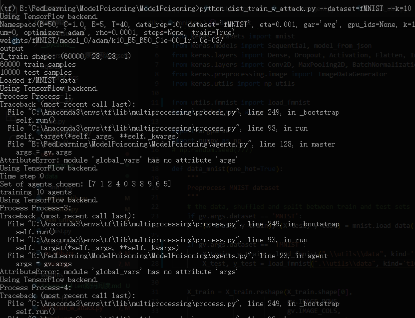

python 全局变量的调用问题：

global 关键字不能初始化变量

global 函数内部定义的全局变量，必须要引用该函数一次才能被其它模块所调用。

#### 代码运行问题：

range输入参数未转int，float类型报错

iteritems在python3下不支持，改用items

### 现在存在问题

代码跑得太慢，我怀疑是GPU参数设置没有成功，是在用cpu跑的。

本文的并行是使用的python的multiprocess库。

## 代码实现流程：

1、使用data_setup() 函数读取训练集和测试集数据。目前使用fashion_mnist数据集进行测试。

2、创建数据分片。分片是通过根据标签进行随机切分的，将训练数据的坐标随机化。

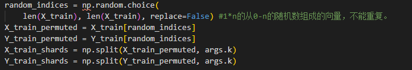

3、根据第二轮的数据分片创建恶意客户端数据集

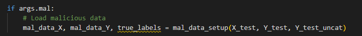

4、初始化master节点模型，启动master节点。

5、初始化client节点模型，分发数据分片。正常客户端拿正常数据分片，恶意客户端用恶意数据集。

6、训练采用train_fn函数

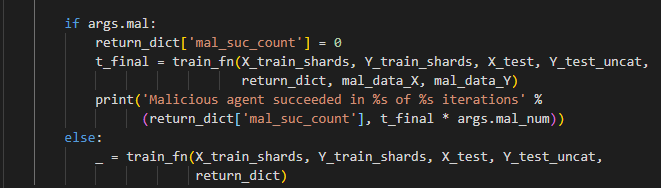

结果变量比如准确率和loss值采用return_dict存储。

本文客户端的模型有A-G以及LR共8种，训练时可以指定。

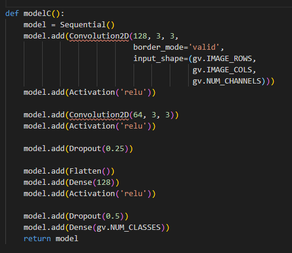

都是CNN深度神经网络。

影响训练速度的原因，应该是CPU

优化方法SGD、Adam、动量。

使用python的multi-processing库实现并行。

如果选择了参数--train，则程序跑的是trian_fn

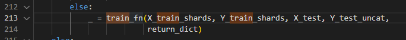

每次都会执行一次init（）根据print("agent's parameter") 看得出来

agent: 训练600步，时间记录一下

根据以下方式选择模型：

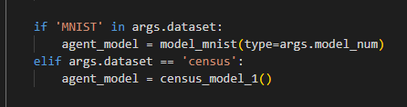

客户端根据文件共享模型：

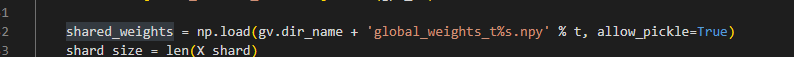

本地模型更新梯度：local_delat 

读取全局模型，选取指定的聚合算法：

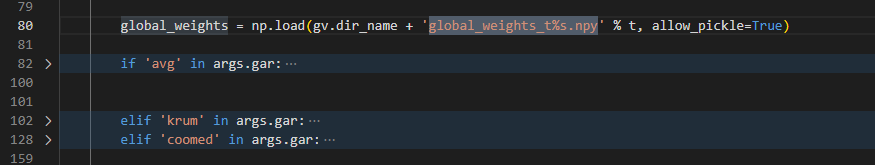

### 源码改造

尝试改写源码：

想尝试只有一个客户端的清醒

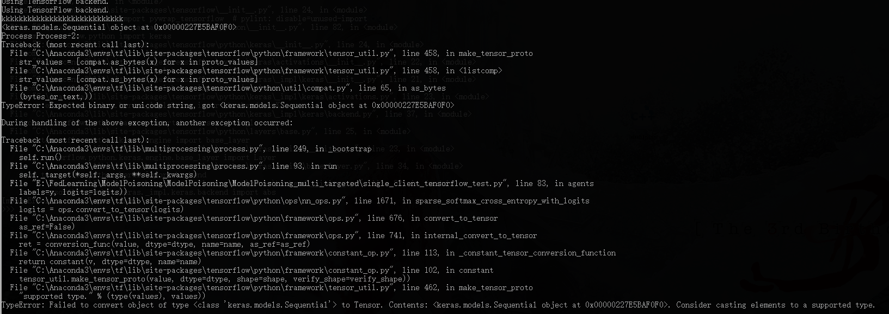

